# Comprehensive Guide: Dockerizing a React App, Pushing to Registry, and Chaos Testing with Chaos Mesh on Minikube

This expanded guide now includes the complete process from dockerizing your React application to running chaos experiments on Kubernetes.

## Table of Contents
1. [Prerequisites](#prerequisites)
2. [Dockerizing the React Application](#dockerizing-the-react-application)
3. [Pushing to Docker Registry](#pushing-to-docker-registry)
4. [Minikube Setup](#minikube-setup)
5. [Chaos Mesh Installation](#chaos-mesh-installation)
6. [Deploying Your Application](#deploying-your-application)
7. [Running Chaos Experiments](#running-chaos-experiments)
8. [Monitoring and Verification](#monitoring-and-verification)
9. [Cleanup](#cleanup)

## Prerequisites

- [Node.js](https://nodejs.org/) (for React development)
- [Docker](https://docs.docker.com/get-docker/)
- [Minikube](https://minikube.sigs.k8s.io/docs/start/)
- [kubectl](https://kubernetes.io/docs/tasks/tools/)
- Docker Hub account (or access to another container registry)

## Dockerizing the React Application

### Prepare Your React Application with Dockerfile in the root folder of the application

I will be creating a `Dockerfile` in the [react-app project](./react-app/Dockerfile) root with multi-stage build:

```dockerfile
# Stage 1: Build the React application 
FROM node:14 as build

WORKDIR /app

COPY package*.json ./

RUN npm install

COPY . .

RUN npm run build

# Stage 2: Serve the React application using Nginx
FROM nginx:stable-alpine

COPY --from=build /app/build /usr/share/nginx/html

# Copy the default nginx.conf provided by the docker image
COPY nginx/nginx.conf /etc/nginx/conf.d/default.conf

EXPOSE 80

CMD ["nginx", "-g", "daemon off;"]
```

## Pushing to Docker Registry

### 1. Build the Docker Image

```bash
docker build -t barry1234/chaos-demo:v0.0.0 .
```

### 2. Test the Image Locally

```bash
docker run -p 3000:80 barry1234/chaos-demo:v0.0.0
```
Visit `http://localhost:3000` to verify it works.

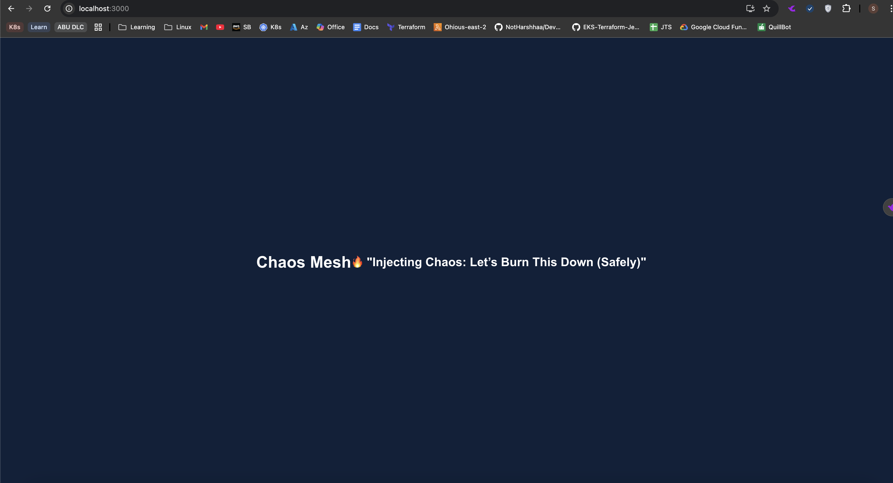

### 3. Log in to Docker Hub

```bash
docker login
```
Enter your Docker Hub credentials when prompted.

### 4. Push the Image to Docker Hub

```bash
docker push barry1234/chaos-demo:v0.0.0
```
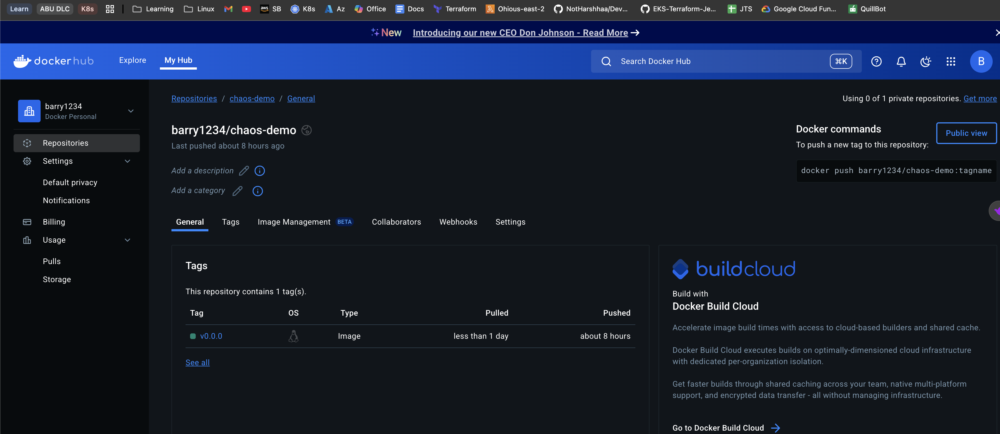
## Minikube Setup

1. **Start Minikube Cluster**:
   ```sh
   minikube start --driver=docker
   ```

2. **Verify Cluster Status**:
   ```sh
   minikube status
   ```

3. **Enable Minikube Addons**:
   ```sh
   minikube addons enable metrics-server
   minikube addons enable dashboard
   ```

## Chaos Mesh Installation

1. **Install Chaos Mesh**:
   ```sh
   curl -sSL https://mirrors.chaos-mesh.org/v2.7.1/install.sh | bash
   ```

2. **Verify Installation**:
   ```sh
   kubectl get pods -n chaos-mesh
   ```
    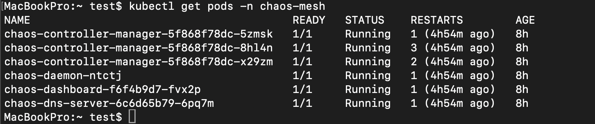
3. **Access Dashboard**:
   ```sh
   kubectl port-forward -n chaos-mesh svc/chaos-dashboard 2333:2333
   ```
   Open http://localhost:2333 in your browser.
    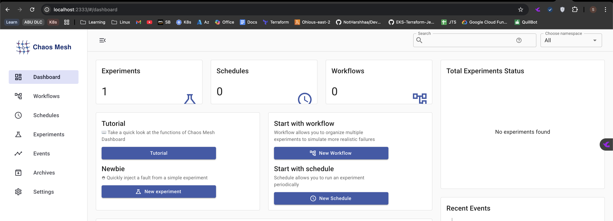
## Deploying Your react Application

1. **I have created a manifest file dfor both the deployment and service in the file** [`deployment-manifest`](./deployment-manifest/app.yaml):
   ```yaml
    apiVersion: apps/v1
    kind: Deployment
    metadata:
    name: react-app
    labels:
        app: react-app
    spec:
    replicas: 3
    strategy:
        rollingUpdate:
        maxSurge: 25%
        maxUnavailable: 25%
    selector:
        matchLabels:
        app: react-app
    template:
        metadata:
        labels:
            app: react-app
        spec:
        containers:
        - name: react-app
            image: barry1234/chaos-demo:v0.0.0
            ports:
            - containerPort: 80
            resources:
            requests:
                cpu: "100m"
                memory: "128Mi"
            limits:
                cpu: "200m"
                memory: "256Mi"
            livenessProbe:
            httpGet:
                path: /
                port: 80
            initialDelaySeconds: 5
            periodSeconds: 5
            readinessProbe:
            httpGet:
                path: /
                port: 80
            initialDelaySeconds: 5
            periodSeconds: 5
    ---
    apiVersion: v1
    kind: Service
    metadata:
    name: react-app-service
    spec:
    selector:
        app: react-app
    ports:
        - protocol: TCP
        port: 80
        targetPort: 80
        nodePort: 30080
    type: NodePort
   ```

3. **Deploy the Application**:
   ```sh
   kubectl apply -f deployment-manifest/app.yaml
   ```
    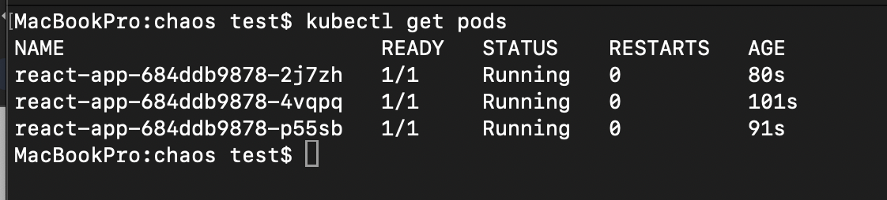

4. **Access Your Application**:
   ```sh
   minikube service react-app-service --url
   ```
    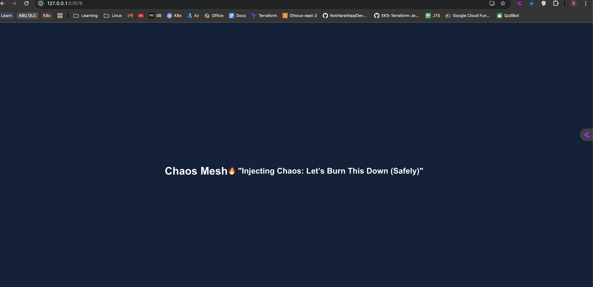

## Running Chaos Experiments

### PodChaos Experiment

1. **Create Experiment File** (`pod-kill-experiment.yaml`):
   ```yaml
   apiVersion: chaos-mesh.org/v1alpha1
   kind: PodChaos
   metadata:
     name: pod-kill-example
     namespace: chaos-mesh
   spec:
     action: pod-kill
     mode: one
     selector:
       namespaces:
         - default
       labelSelectors:
         'app': 'react-app'
   ```

2. **Apply the Experiment**:
   ```sh
   kubectl apply -f podchaos.yaml
   ```

    Result: A pod will be terminated which satisfies the experiement complemeted
    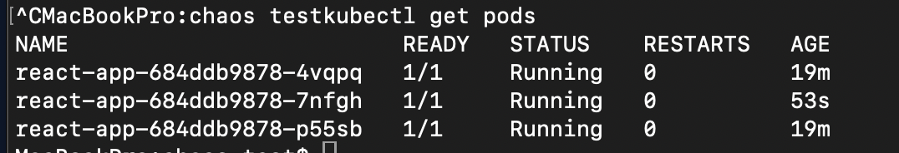
    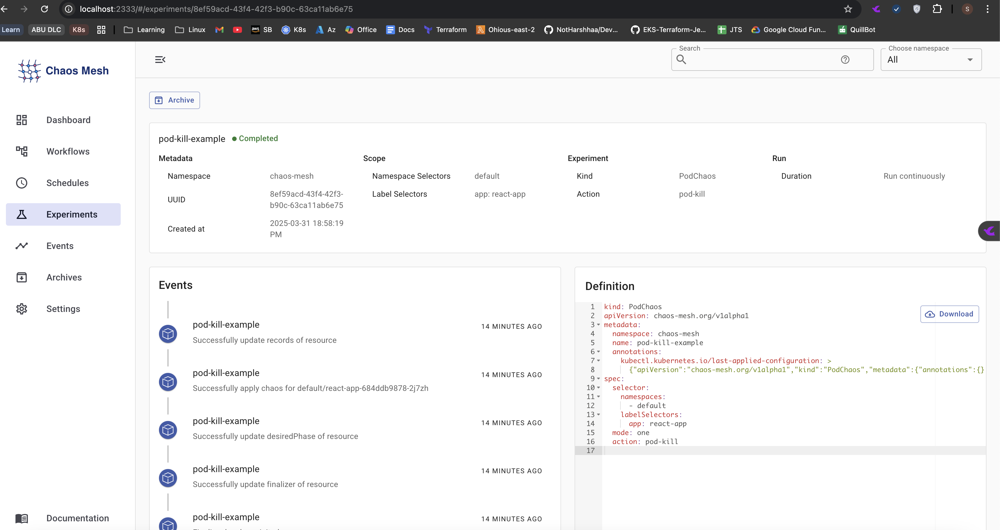

### HTTPChaos Experiment

1. **Create Experiment File** (`http-chaos.yaml`):
   ```yaml
   apiVersion: chaos-mesh.org/v1alpha1
   kind: HTTPChaos
   metadata:
     name: test-http-chaos
     namespace: chaos-mesh
   spec:
     mode: all
     selector:
       namespaces:
         - default
       labelSelectors:
         app: react-app
     target: Request
     port: 80
     method: GET
     path: /
     abort: true
     duration: 5m
   ```
2. **Apply the Experiment**:
   ```sh
   kubectl apply -f http-chaos.yaml
   ```

   Result: The application becomes inaccessible for 5 minutes
   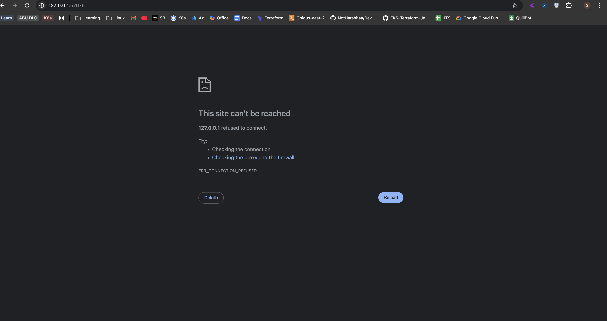

   Also we can get to see the process from the chaos-mesh ui
   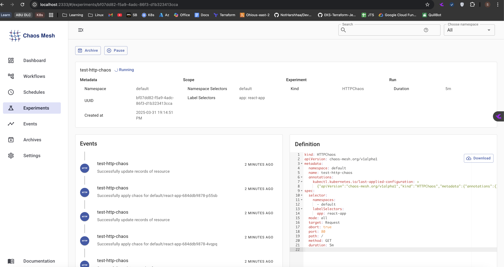

   Once the experiement time elapse, the application becomes accessbile.

## Monitoring and Verification

1. **View Kubernetes Resources**:
   ```sh
   kubectl get pods,svc -l app=react-app -w
   ```

2. **Check Chaos Mesh Dashboard**:
   ```sh
   kubectl port-forward -n chaos-mesh svc/chaos-dashboard 2333:2333
   ```
    {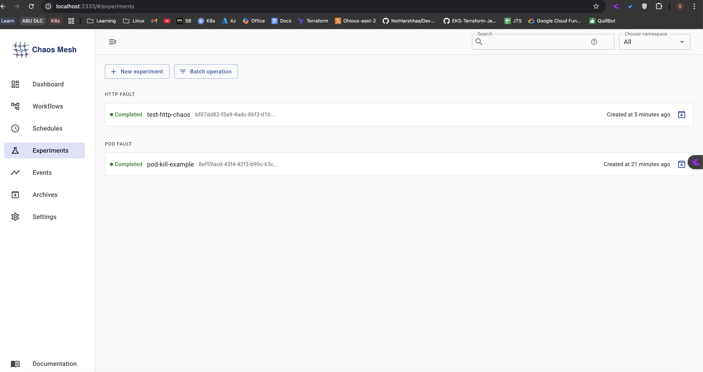)
    The above shows the list of chaos experiment that was carried out.

3. **View Application Logs**:
   ```sh
   kubectl logs -l app=react-app --tail=50 -f
   ```

## Cleanup

1. **Delete Experiments**:
   ```sh
   kubectl delete -f podchaos.yaml
   kubectl delete -f http-chaos.yaml
   ```

2. **Uninstall Chaos Mesh**:
   ```sh
   curl -sSL https://mirrors.chaos-mesh.org/v2.7.1/install.sh | bash -s -- --template | kubectl delete -f -
   ```

3. **Delete Application**:
   ```sh
   kubectl delete -f app.yaml
   ```

4. **Stop Minikube**:
   ```sh
   minikube stop
   ```

